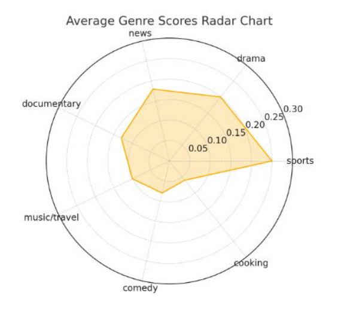

# Multimodal ACR Pipeline

This repository contains the implementation of a **Multimodal Automatic Content Recognition (ACR)** system that processes real-time video streams, applies action recognition and OCR, and performs zero-shot genre classification using a transformer-based language model.

The codebase has been **tested on Ubuntu 20.04 with Python 3.8.10**.

## 📁 Repository Structure

| File | Description |
|------|-------------|
| `client.py` | Raspberry Pi client code. Captures video, runs **MoViNet** action recognition locally, and sends results to the server. |
| `client_only.py` | Standalone version of `client.py` without networking; useful for testing MoViNet locally on Pi. |
| `server.py` | GPU server-side code. Receives multimodal input, applies OCR using **PaddleOCR**, performs genre classification using **BART**, and returns results. |
| `server_only.py` | Standalone version of `server.py` for local testing without client communication. |
| `local_environment.py` | Full pipeline integration that runs entirely on a single local machine for development and testing purposes. |

## 📦 Environment Setup

### Requirements
- Python 3.8.10
- Ubuntu 20.04 (or compatible Linux OS)
- GPU (for running the server with Transformer-based genre classification)

You can install dependencies via: requirements.txt

## ⚙️ Usage

### 1. Run on Local Device (No Networking)
```bash
python local_environment.py --video videos.mp4
```

### 2. Run Client on Raspberry Pi
```bash
python client.py --video videos.mp4
```
### 2-1. For Client_only
```bash
python client_only.py --video videos.mp4 --movinet_res out.txt
```

### 3. Run Server on GPU Machine
```bash
python server.py --video videos.mp4
```

### 3-1. For Server_only
```
python server_only.py --video videos.mp4 --movinet_res out.txt
```

Ensure the client and server are reachable over the network and that firewalls do not block required ports.


## 📊 Sample Output & Visualization

When running the pipeline, the system generates frame-wise genre scores like the following:

```
[Genre] news (scores: {'news': 0.94, 'drama': 0.02, 'documentary': 0.01, 'sports': 0.005, ... })
```

For each video, the system aggregates genre probabilities across all frames and selects the genre with the highest cumulative score as the final prediction. For example, if "news" has consistently the highest probability across frames, the system predicts the video as a news content.

The figure below shows a **radar chart** of the average genre scores over multiple frames. It visually represents the relative confidence of the model in each genre category:



- A larger radius toward a genre (e.g., `news`, `sports`) indicates higher model confidence.
- Flattened or small regions (e.g., `comedy`, `cooking`) indicate lower relevance for that content.
- This chart helps diagnose genre ambiguity and visualize how well the model distinguishes between types of content.
  
## 📌 Notes

- For systems where PaddleOCR causes segmentation faults on ARM-based devices (e.g., Raspberry Pi), we **offload OCR to the server**.
- For environments where network communication is restricted (e.g., blocked ports), use `client_only.py` and `server_only.py` for testing.
